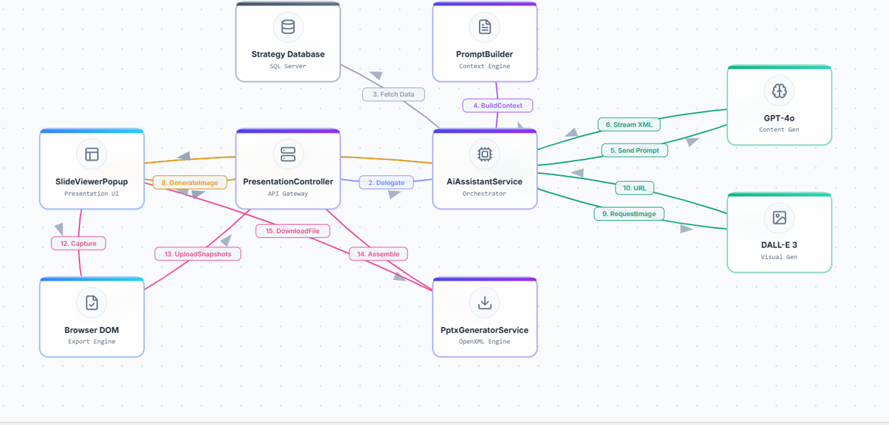
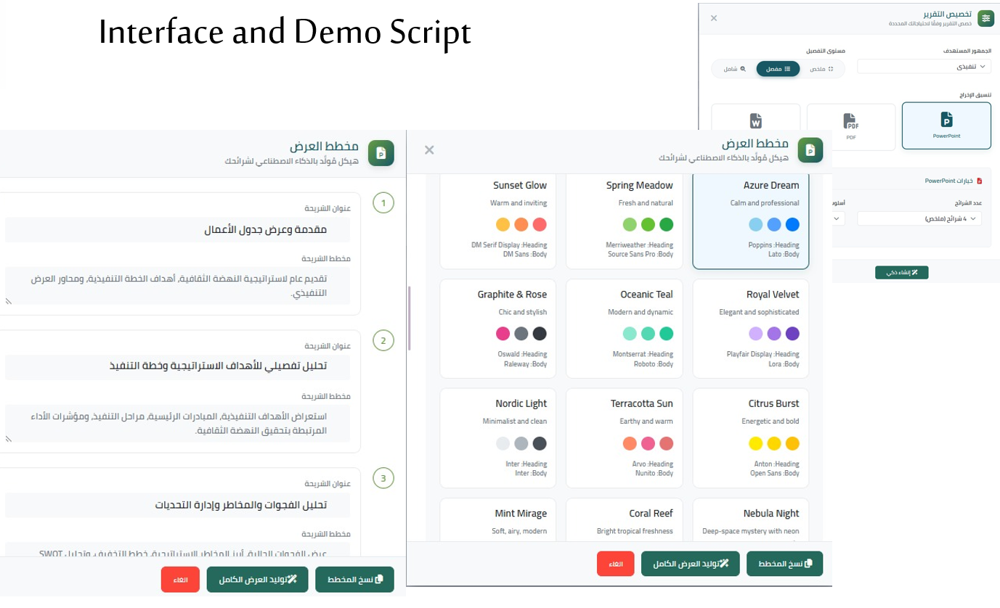

# StratSynth – AI-Driven Strategic Reporting

## 📌 Overview
StratSynth is a sophisticated, enterprise-grade reporting ecosystem that uses **Generative AI** to transform complex strategic data into compelling, actionable insights.  
It empowers executives and stakeholders with instant, tailored presentations and reports featuring KPIs, risks, and initiatives — eliminating manual bottlenecks and accelerating decision-making.

---

## 🎯 Objectives
- Automate high-value reporting tasks across strategic planning workflows.  
- Replace manual data analysis with instant, AI-generated insights.  
- Deliver consistent, audience-adapted presentations and reports.  
- Enhance executive visibility into KPIs, risks, and initiatives.

---

## ⚙️ Features
- **Stored Procedures**: Efficient querying of strategic data from SQL Server.  
- **Python Backend**: Processes data and orchestrates report generation.  
- **Generative AI**: Uses DALL·E to create charts, visuals, and branded imagery.  
- **Angular Frontend**: Delivers interactive reports and presentations.  
- **Audience Adaptation**: Tailors content for executives, managers, and stakeholders.  
- **Visual Storytelling**: Combines data with narrative for impactful delivery.

---

## 🛠️ Technical Implementation
- **Backend**: Python orchestrates data flow and AI generation.  
- **Database**: SQL Server with stored procedures for complex queries.  
- **AI Integration**: DALL·E generates visuals and charts from strategic data.  
- **Frontend**: Angular components for dynamic report rendering.  
- **Architecture**: Modular, scalable, and presentation-ready.

---

## 📊 Workflow Diagram

---
## 📊 UI Design

---

## 📈 Business Value
- Reduced reporting time from weeks to seconds.  
- Improved consistency and clarity in executive communication.  
- Enabled proactive decision-making with instant insights.  
- Scalable across departments and strategic domains.

---

## 📄 Future Enhancements
- Add voice-to-report generation for executive briefings.  
- Integrate predictive analytics for strategic forecasting.  
- Enable multilingual report generation. 

---

## 🔗 Notes
This repository includes **documentation, diagrams, and screenshots only**.  
Source code and strategic data are excluded due to confidentiality.
