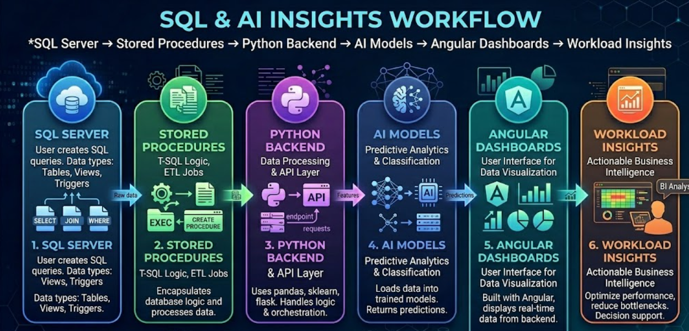
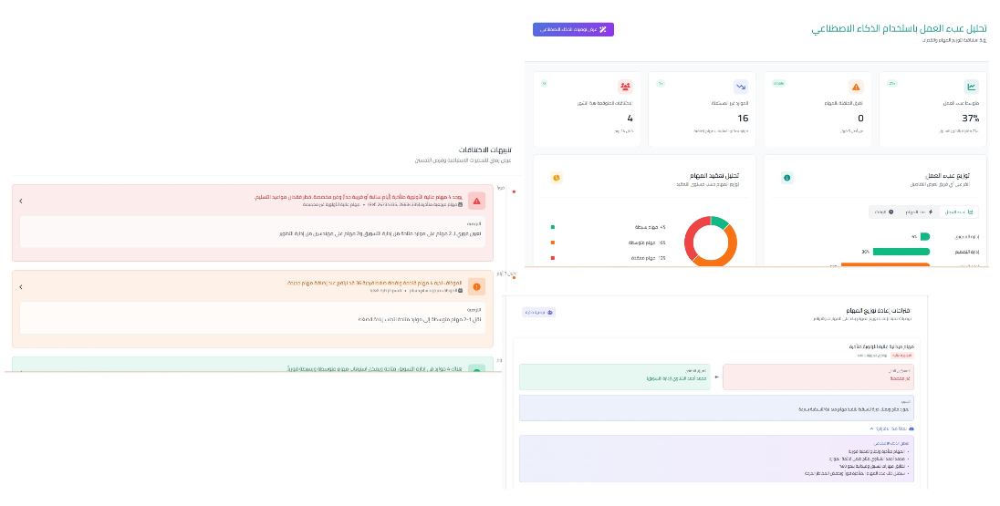

# TaskLens – AI-Powered Workload Analytics

## 📌 Overview
TaskLens empowers organizations by applying AI-driven analytics to task distribution and workload management across ** SMEEM platform **.  
The system provides real-time visibility into task allocation, detects inefficiencies, and recommends proactive adjustments — ensuring fairness, transparency, and strategic alignment.

---

## 🎯 Objectives
- Provide a clear view of workload distribution across the organization.  
- Enable proactive decision-making before bottlenecks arise.  
- Ensure fair and transparent task assignment.  
- Improve resource utilization and reduce waste.  
- Suggest alternative solutions during sudden changes.

---

## ⚙️ Features
- **Workload Visualization**: Dashboards show task distribution across teams.  
- **Fairness & Transparency**: AI ensures balanced task assignment.  
- **Efficiency Optimization**: Detects time/resource waste and suggests improvements.  
- **Scenario Flexibility**: Recommends alternatives during disruptions.  

---

## 🛠️ Technical Implementation
- **Backend**: Python orchestrates workload analytics and AI logic.  
- **Database**: SQL Server with stored procedures for task data queries.  
- **AI Integration**: Models analyze workload patterns and generate recommendations.  
- **Frontend**: Angular components for interactive dashboards and workload views.  
- **Architecture**: Modular design integrated into SMEEM’s task management module.

---

## 📊 Workflow Diagram

---

## 📊 UI Design

---

## 📈 Business Value
- Increased visibility into organizational workload.  
- Reduced employee complaints through fair task distribution.  
- Improved operational efficiency and resource allocation.  
- Enabled proactive adjustments during unexpected changes.  
- Strengthened strategic alignment across teams and initiatives.

---

## 📄 Future Enhancements
- Add predictive workload forecasting.  
- Integrate real-time alerts for overload detection.  
- Expand multilingual dashboards with cultural adaptation.  
- Support export to executive-ready reports and presentations.

---

## 🔗 Notes
This repository includes **documentation, diagrams, and screenshots only**.  
Source code and sensitive organizational data are excluded due to confidentiality.
