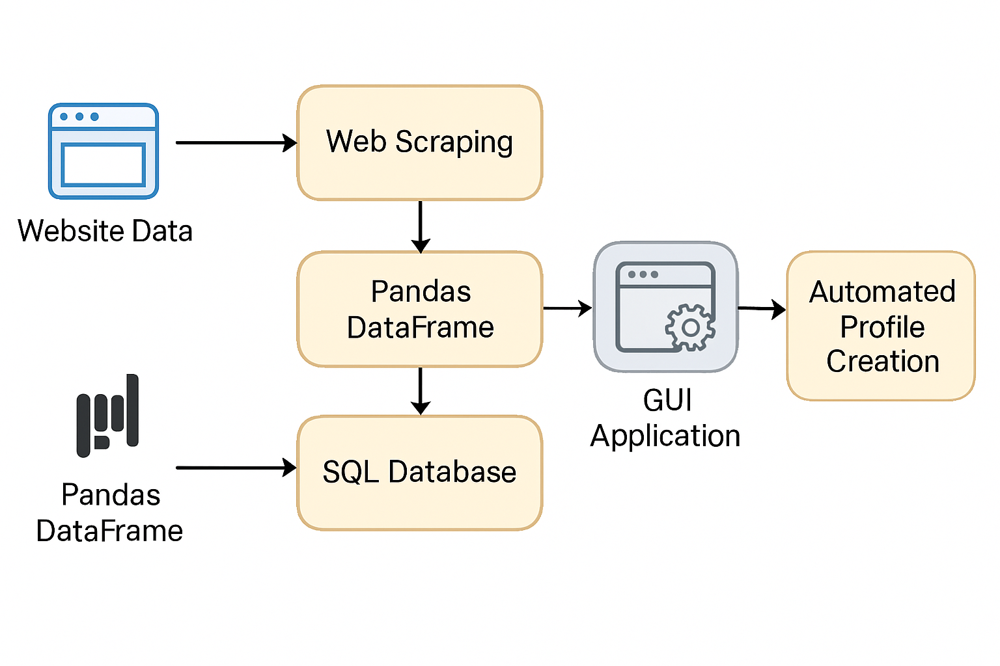

# AutoDevFlow -- Development Automation

## 📌 Overview
A GUI-based automation tool designed to streamline the process of adding **development area profiles** into the enterprise database.  
The application integrates **web scraping** with database queries to collect and validate information, while also handling **Excel files** for bulk data operations.  
This solution significantly reduced manual effort, improved accuracy, and enhanced overall efficiency in the development workflow.

---

## 🎯 Objectives
- Automate repetitive tasks in the development workflow.  
- Reduce manual data entry and minimize human error.  
- Integrate multiple data sources (websites, databases, Excel files).  
- Provide a user-friendly interface for non-technical users.  

---

## ⚙️ Features
- **Web Scraping**: Extracts relevant data from websites to enrich development profiles.  
- **Database Integration**: Fetches and updates records directly from SQL databases.  
- **Excel Automation**: Uses Pandas DataFrames to process Excel files, replacing manual work.  
- **GUI Application**: Simplifies workflows with an intuitive interface.  
- **Workflow Efficiency**: Automates profile creation and validation steps.  

---

## 🛠️ Technical Implementation
- **Backend**: FastAPI for API endpoints and automation logic.  
- **Data Handling**: Pandas for Excel file processing and data transformation.  
- **Database**: SQL for structured storage and queries.  
- **Automation**: Combined web scraping + database operations to unify data sources.  
- **Interface**: GUI application for streamlined user interaction.  

---

## 📊 Workflow Diagram

---

## 📈 Business Value
- Reduced manual workload by automating profile creation.  
- Improved accuracy in data entry and validation.  
- Enhanced efficiency in development workflows.  
- Provided a scalable solution adaptable to other enterprise processes.  

---

## 📄 Future Enhancements
- Add scheduling for automated scraping and updates.  
- Expand support for additional file formats (PDF, JSON).  
- Integrate with enterprise authentication systems.  
- Provide advanced reporting dashboards.  

---

## 🔗 Notes
This repository contains **documentation, diagrams, and screenshots only**.  
Due to confidentiality, source code and sensitive data are not included.
