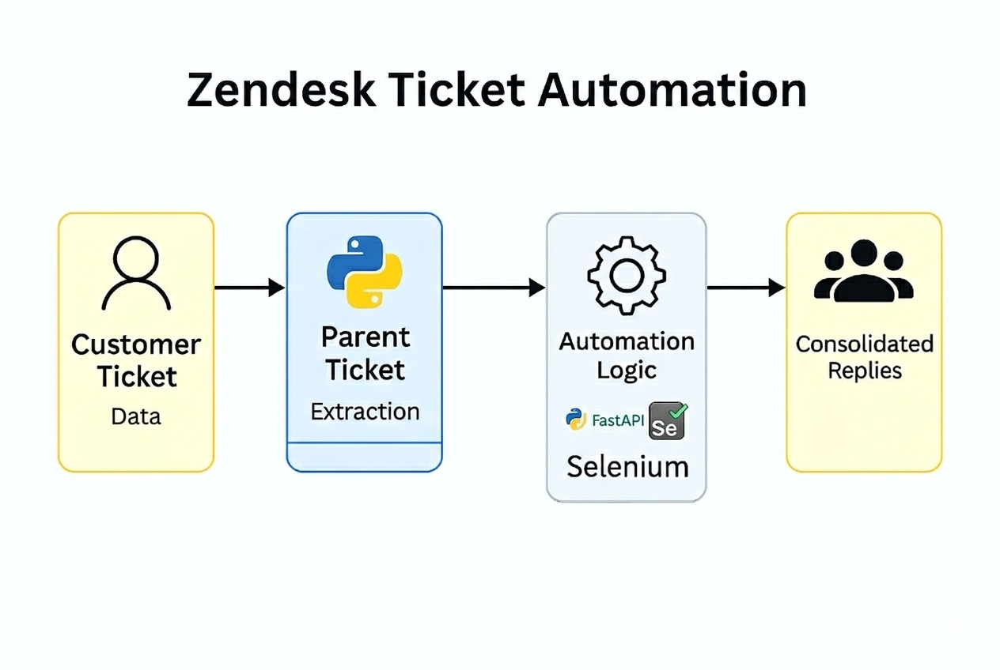

# CRM Automation – Zendesk Ticket Distribution

## 📌 Overview
An automation solution built for the **Zendesk CRM system** to streamline customer support workflows.  
The project automatically processes new customer tickets, extracts data from parent tickets, and distributes requests to the correct functional areas.  
Developed using **Python, FastAPI, and Selenium**, the system ensures faster and more accurate CRM ticket management.

---

## 🎯 Objectives
- Automate ticket classification and distribution within the Zendesk CRM platform.  
- Reduce manual triage effort and accelerate customer response cycles.  
- Ensure each department or function receives only the requests relevant to its scope.  
- Improve CRM communication consistency by consolidating replies per functional area.

---

## ⚙️ Features
- **Ticket Monitoring**: Detects new customer tickets in Zendesk CRM.  
- **Data Extraction**: Retrieves structured information from parent tickets.  
- **Automated Distribution**: Routes requests to the correct functional area or department.  
- **Consolidated Replies**: Ensures each area provides a single, unified response.  
- **Scalability**: Modular design adaptable to other CRM platforms.

---

## 🛠️ Technical Implementation
- **Backend**: Python with **FastAPI** for workflow orchestration and API integration.  
- **Automation**: **Selenium** for web automation and interaction with Zendesk’s CRM interface.  
- **Logic**: Custom parsing of ticket metadata to identify request type and route accordingly.  
- **Architecture**: Modular, reusable processes for scalability and maintainability.  

---

## 📊 Workflow Diagram

---

## 📈 Business Value
- Reduced manual triage time and improved ticket routing accuracy.  
- Accelerated CRM response cycles, enhancing customer satisfaction.  
- Minimized misrouting and duplicate efforts across departments.  
- Provided a scalable automation framework extendable to other CRM systems.  

---

## 📄 Future Enhancements
- Integration with advanced analytics for ticket prioritization.  
- Dashboard visualization of ticket flow and response metrics.  
- AI-powered classification for more complex CRM requests.  

---

## 🔗 Notes
This repository contains **documentation, diagrams, and screenshots only**.  
Due to confidentiality, source code and sensitive CRM data are not included.
