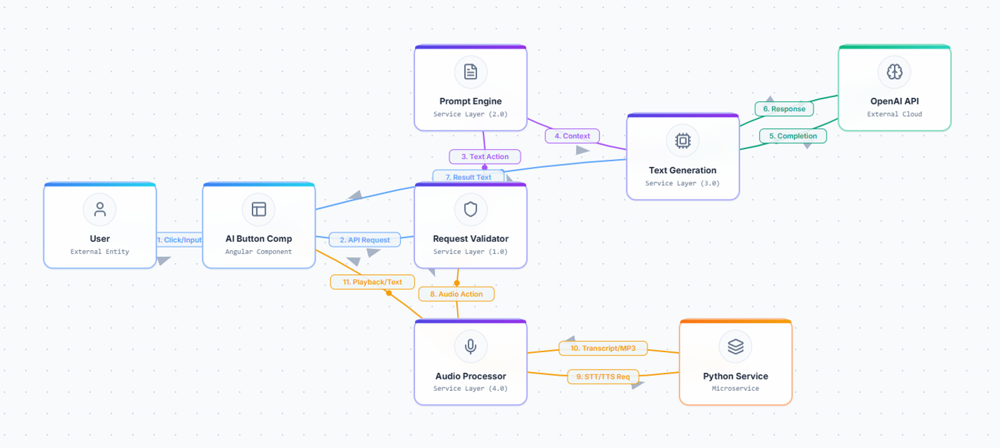
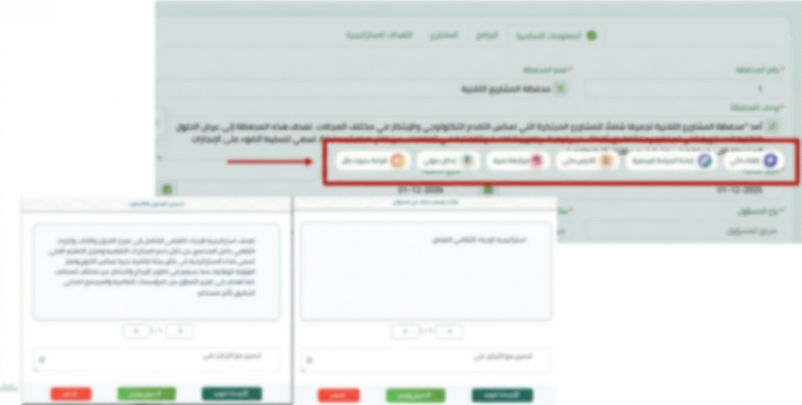

# ContextGen – AI-Powered Content Engine SMEEM Platform

## 📌 Overview
ContextGen is a context-aware content generation engine built to drastically reduce the administrative burden and cognitive load associated with strategic reporting.  
By leveraging AI-driven text generation, summarization, and reformatting, the platform accelerates the data entry lifecycle and shifts employee effort from writing mechanics to high-value strategic thinking.

---

## 🎯 Objectives
- Overcome "writer’s block" with AI-assisted content generation.  
- Accelerate system updates and reporting cycles.  
- Ensure organizational knowledge bases remain current.  
- Adapt content for different audiences and communication styles.  

---

## ⚙️ Features
- **Text Generation**: Draft, refine, and insert polished text effortlessly.  
- **Summarization**: Condense long documents into concise executive summaries.  
- **Reformatting**: Adjust tone, style, and structure for different audiences.  
- **Voice Integration**: Convert speech to text and text to speech for hands-free productivity.  
- **Multilingual Support**: Enable seamless communication across multiple languages.  

---

## 🛠️ Technical Implementation
- **Backend**: Python orchestrates AI-driven content generation and summarization.  
- **Database**: SQL Server with stored procedures for structured data queries.  
- **Frontend**: Angular components for interactive editing and content visualization.  
- **AI Integration**: Generative models for text, summarization, and multilingual adaptation.  
- **Architecture**: Modular design enabling integration into strategic reporting workflows.  

---

## 📊 Workflow Diagram

---
## 📊 UI Design 

---

## 📈 Business Value
- Reduced administrative burden and reporting time.  
- Increased velocity of system updates and knowledge base accuracy.  
- Enhanced productivity by shifting focus to strategic thinking.  
- Improved communication consistency across audiences and languages.  

---
## 🔗 Notes
This repository includes **documentation, diagrams, and screenshots only**.  
Source code and sensitive organizational data are excluded due to confidentiality.
The UI design screenshot has been **blurred intentionally** to protect sensitive information while preserving layout and structure.
