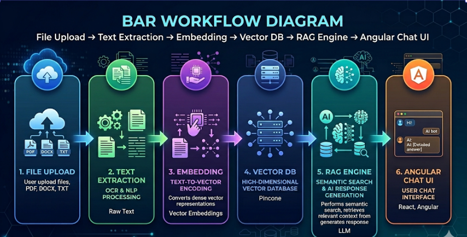
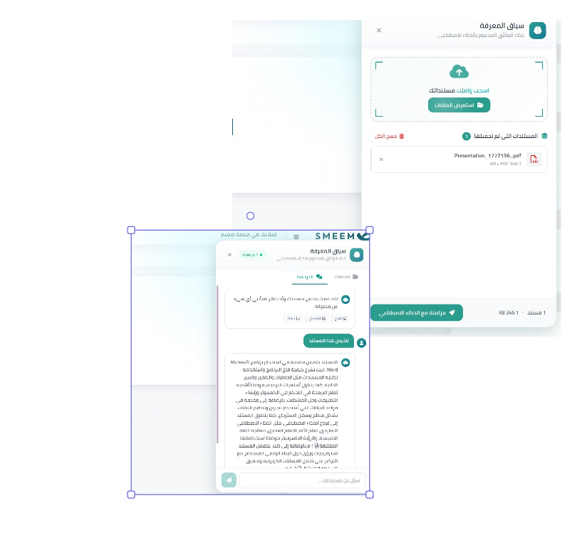

# DocuChat – Intelligent Document Chat

## 📌 Overview
DocuChat is an AI-powered document interaction engine **SMEEM Platform** that enables users to upload PDFs, Word, and text files, then chat with them directly.  
The system extracts content, embeds it into a vector database, and uses Retrieval-Augmented Generation (RAG) to answer user questions with context-aware precision.

---

## 🎯 Objectives
- Allow users to upload and interact with documents conversationally.  
- Extract and embed document content for semantic search.  
- Use RAG to generate accurate, context-aware responses.  
- Support multilingual, voice-enabled, and real-time document analysis.

---

## ⚙️ Features
- **File Upload**: Supports PDF, Word, and plain text formats.  
- **Text Extraction**: Uses PyPDF2 and other libraries for parsing.  
- **Embedding & Indexing**: Converts text into vector embeddings for semantic search.  
- **Vector Database**: Stores indexed chunks for fast retrieval.  
- **RAG Engine**: Combines retrieval and generation for accurate answers.  
- **Angular Frontend**: Interactive UI for document upload and chat.  
- **Multilingual Support**: Enables broader accessibility.

---

## 🛠️ Technical Implementation
- **Backend**: Python handles file parsing, embedding, and RAG logic.  
- **Libraries**: PyPDF2, python-docx, langchain, sentence-transformers.  
- **Database**: Vector DB (Pinecone) for semantic indexing.  
- **Frontend**: Angular components for file upload and chat interface.  
- **Architecture**: Modular design supporting real-time document interaction.

---

## 📊 Workflow Diagram

---

---

## 📊 UI Design

---

## 📈 Business Value
- Eliminates manual document review and search.  
- Accelerates knowledge access across uploaded files.  
- Enhances productivity with real-time, AI-powered responses.  
- Supports multilingual. 
- Scales across departments for document-heavy operations.
- Support collaborative chat across shared documents.

---

## 📄 Future Enhancements
- Integrate document comparison and version tracking.   
- Expand voice-to-chat and chat-to-speech capabilities.

---

## 🔗 Notes
This repository includes **documentation, diagrams, and screenshots only**.  
Source code and uploaded documents are excluded due to confidentiality.
