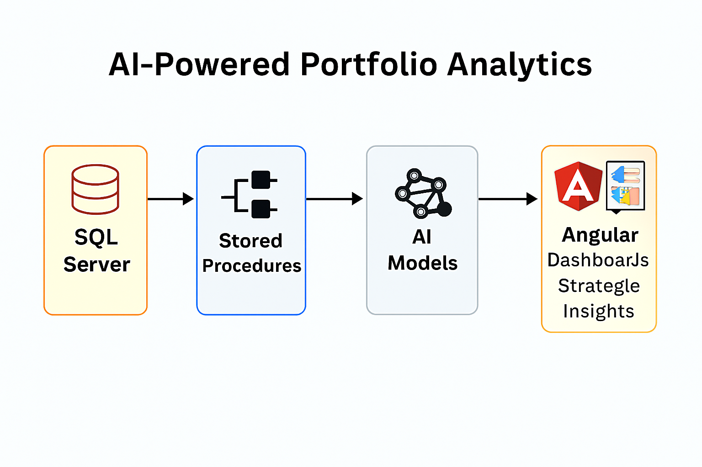
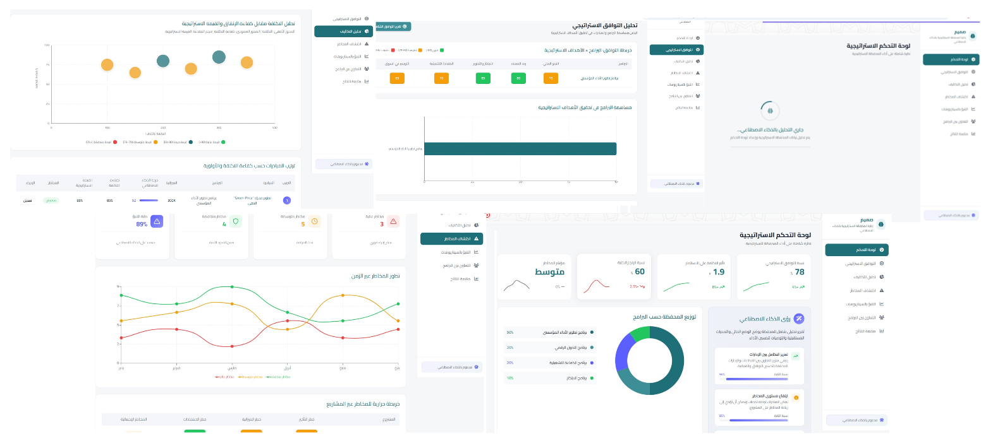

# PortfoAI – Strategic Portfolio Analytics

## 📌 Overview
PortfoAI integrates portfolio data into the **SMEEM strategic Platform** and applies AI-powered analytics to generate dashboards, insights, and actionable recommendations.  
The platform continuously reviews initiatives and projects to ensure alignment with strategic goals, providing executives with real-time visibility into performance, risks, and investment priorities.

---

## 🎯 Objectives
- Ensure initiatives and projects remain aligned with portfolio objectives.  
- Provide dashboards highlighting programs contributing most to KPIs.  
- Detect risks early (delays, budget overruns, conflicts).  
- Simulate "what-if" scenarios for proactive decision-making.  
- Identify overlaps and collaboration opportunities across programs.  
- Track long-term strategic outcomes beyond project completion.  

---

## ⚙️ Features
- **Investment Prioritization**: AI highlights initiatives with the highest strategic ROI.  
- **Risk Detection**: Heatmaps reveal portfolio risks for early intervention.  
- **Scenario Forecasting**: Simulates funding cuts or resource shifts.  
- **Collaboration Insights**: Detects overlapping efforts across programs.  
- **Outcome Tracking**: Evaluates whether initiatives achieve long-term goals.  

---

## 🛠️ Technical Implementation
- **Backend**: Python orchestrates analytics and AI-driven insights.  
- **Database**: SQL Server with stored procedures for complex portfolio queries.  
- **AI Integration**: Models generate dashboards, forecasts, and recommendations.  
- **Frontend**: Angular components for interactive dashboards and portfolio views.  
- **Architecture**: Modular design ensuring scalability across portfolios.  

---

## 📊 Workflow Diagram

---

---

## 📊 UI Design

---

## 📈 Business Value
- Reduced analysis time with AI-driven dashboards.  
- Improved resource allocation through investment prioritization.  
- Enhanced risk management with proactive detection.  
- Enabled scenario-based decision-making for executives.  
- Increased efficiency by identifying overlaps and collaboration opportunities.  
- Ensured portfolio outcomes align with long-term strategic goals.  

---

## 📄 Future Enhancements 
- Expand multilingual dashboards with cultural adaptation.  
- Support export to executive-ready reports and presentations.  

---

## 🔗 Notes
This repository includes **documentation, diagrams, and screenshots only**.  
Source code and sensitive portfolio data are excluded due to confidentiality.
