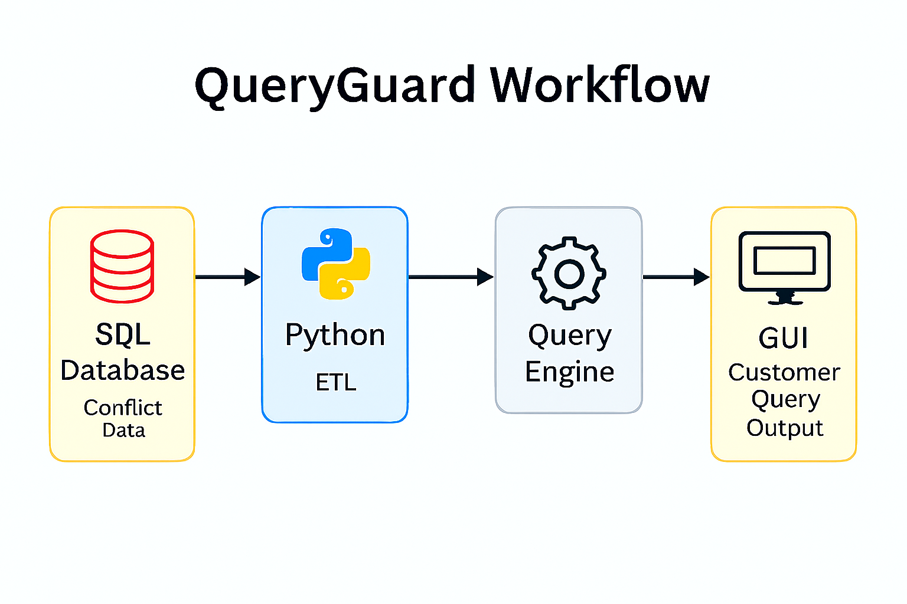

# QueryGuard – Automated Ticket Query System

## 📌 Overview
QueryGuard is a GUI-based tool designed to automate customer ticket queries related to conflict data.  
It extracts and analyzes data from SQL databases using Python, then formulates customer-specific queries to proactively address potential issues.

---

## 🎯 Objectives
- Automate the generation of customer queries based on conflict data.  
- Improve data accuracy and reduce manual effort in ticket handling.  
- Enable proactive conflict detection and resolution.  
- Enhance customer satisfaction through faster, more relevant responses.

---

## ⚙️ Features
- **SQL + Python Integration**: Connects to databases using Python and SQL queries.  
- **Data Cleaning & Analysis**: Uses Pandas to clean and structure conflict-related data.  
- **Query Formulation**: Automatically generates customer-specific queries based on detected patterns.  
- **GUI Interface**: User-friendly interface for support teams to interact with the system.  
- **Proactive Alerts**: Flags potential conflict areas before they escalate.

---

## 🛠️ Technical Implementation
- **Data Source**: SQL database containing customer tickets and conflict logs.  
- **ETL Pipeline**: Python scripts extract and clean data using Pandas.  
- **Query Engine**: Logic built to detect conflict patterns and generate relevant queries.  
- **GUI Layer**: Built with Tkinter (or preferred framework) for ease of use.  
- **Deployment**: Local or server-based deployment for support team access.

---

## 📈 Business Value
- Reduced manual query formulation time.  
- Improved accuracy and relevance of customer responses.  
- Early conflict detection leads to better customer retention.  
- Scalable framework for broader ticket automation initiatives.

---
## 📊 Workflow Diagram

---
## 📄 Future Enhancements
- Add NLP for smarter query generation.  
- Integrate with CRM platforms (e.g., Zendesk, Salesforce).  
- Enable dashboard view for ticket trends and conflict hotspots.  
- Support multilingual query templates.

---

## 🔗 Notes
This repository includes **documentation**.   
Source data is excluded due to confidentiality.
