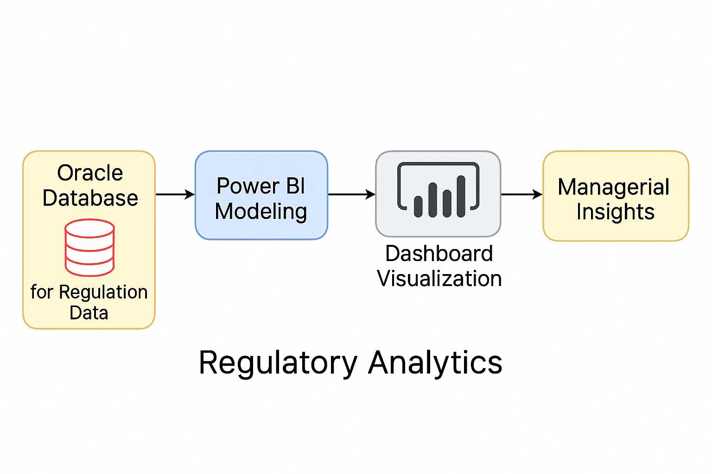
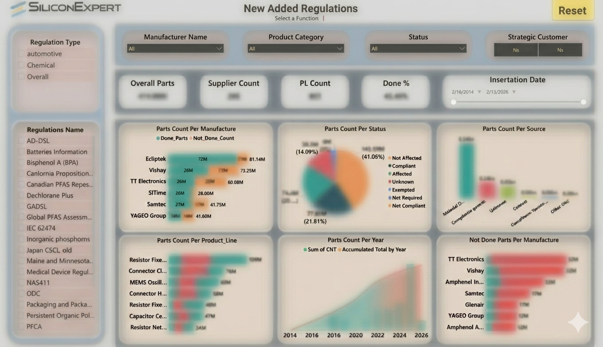

# Regulation Analytics Dashboard

## 📌 Overview
An interactive analytics dashboard designed to monitor the implementation of newly added regulations across organizational workflows.  
Built using **SQL** and **Power BI**, the dashboard provides real-time insights into progress, bottlenecks, and compliance status, helping managers stay informed and proactive.

---

## 🎯 Objectives
- Track the execution of new regulations across departments and workflows.  
- Provide managers with clear visibility into progress and delays.  
- Enable data-driven decision-making and early risk detection.  
- Centralize reporting for compliance and operational efficiency.

---

## ⚙️ Features
- **Workflow Monitoring**: Visualizes progress of regulation-related tasks and milestones.  
- **Progress Tracking**: Highlights completed, pending, and delayed items.  
- **Managerial Insights**: Offers high-level summaries and drill-down views.  
- **SQL Integration**: Pulls live data from enterprise databases.  
- **Power BI Visualizations**: Interactive charts, KPIs, and filters for dynamic analysis.

---

## 🛠️ Technical Implementation
- **Data Source**: SQL Server database containing regulation metadata and workflow logs.  
- **Data Modeling**: SQL queries and views structured for Power BI consumption.  
- **Visualization Layer**: Power BI dashboards with slicers, filters, and conditional formatting.  
- **Deployment**: Shared via Power BI workspace for organizational access.

---

## 📊 Workflow Diagram

---

## 🖼️ Dashboard
  

---

## 📈 Business Value
- Improved transparency in regulation implementation.  
- Faster identification of delays and compliance risks.  
- Empowered managers with real-time, actionable insights.  
- Scalable framework for future regulatory tracking initiatives.

---

## 📄 Future Enhancements
- Add predictive analytics for regulation impact forecasting.  
- Integrate with task management systems (e.g., Jira, Planner).  
- Enable alerting and email notifications for critical delays.  
- Support multilingual dashboards for broader accessibility.

---

## 🔗 Notes
This repository includes **SQL code samples**, **dashboard screenshots**, and **documentation**.  
Source data and full Power BI files are excluded due to confidentiality.  
The dashboard screenshot has been **blurred intentionally** to protect sensitive information while preserving the layout and visual structure.
