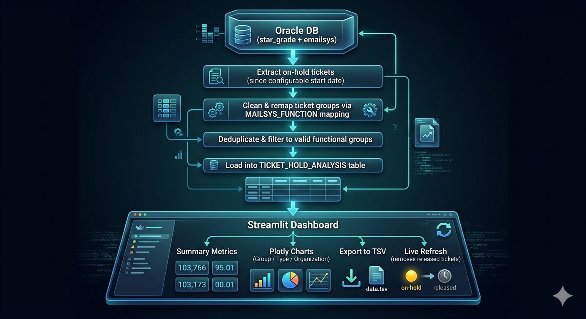
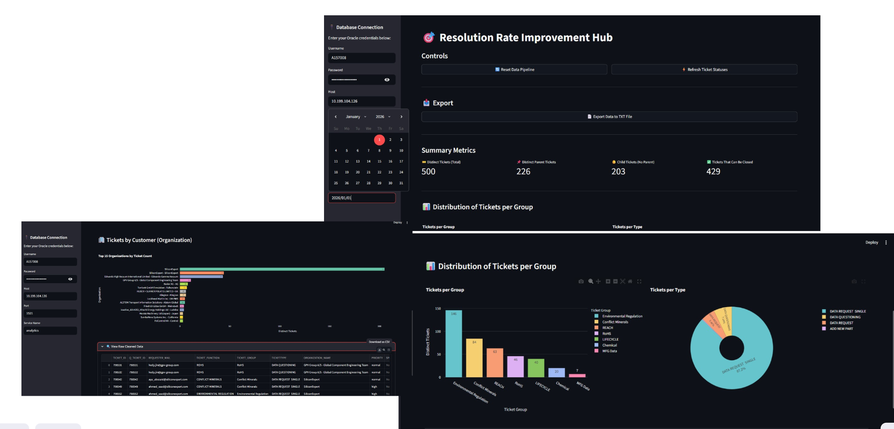

# Resolution Rate Improvement Hub – Oracle & Zendesk Analytics Dashboard

## 📌 Overview

A data analytics and automation solution built to **improve ticket resolution rates and customer satisfaction** within the **Zendesk CRM system**.  
The project extracts on-hold ticket data from an Oracle database, applies intelligent group mapping logic, and delivers an interactive Streamlit dashboard with Plotly visualizations.  
Developed using **Python, Streamlit, cx_Oracle, and Plotly**, the system empowers support managers to track SLA performance, identify bottlenecks, and drive measurable improvements in resolution rates.

---

## 🎯 Objectives

- Identify tickets currently on hold that are fully actionable and ready to be closed.  
- Track and improve **SLA compliance** by surfacing delayed or stalled tickets across functional groups.  
- Improve **customer satisfaction (CSAT)** by reducing unnecessary hold time on resolvable tickets.  
- Enable managers to report progress on resolution rate improvements directly to upper management.  
- Provide exportable reports for offline sharing and management presentations.

---

## ⚙️ Features

- **Data Pipeline Reset**: Extracts all on-hold tickets from Oracle since a configurable start date, cleans and classifies them, and loads them into a dedicated analysis table.  
- **Intelligent Group Mapping**: Automatically corrects misclassified ticket groups using a `MAILSYS_FUNCTION` mapping layer, ensuring accurate distribution reporting.  
- **Live Refresh**: Detects and removes tickets that are no longer on hold, keeping the dashboard in sync with real-time CRM status.  
- **Resolution Rate Metrics**: Calculates how many tickets can be immediately closed based on parent/child ticket relationships.  
- **Interactive Charts**: Plotly bar and pie charts visualize ticket distribution by group, type, and organization.  
- **Data Export**: One-click export of the cleaned dataset as a `.txt` (TSV) file for management reporting.  
- **Sidebar Credential Management**: Secure, session-level Oracle database connection configured directly in the UI.  
- **Performance Caching**: Dashboard data is cached to avoid redundant database queries on every UI interaction.

---

## 🛠️ Technical Implementation

- **Frontend**: Python **Streamlit** for the interactive web dashboard UI.  
- **Database**: **Oracle DB** accessed via `cx_Oracle` with bind variable parameterization to prevent SQL injection.  
- **Data Processing**: **Pandas** for in-memory cleaning, deduplication, group remapping, and metric aggregation.  
- **Visualization**: **Plotly Express** for bar charts, pie/donut charts, and horizontal organization-level charts.  
- **Architecture**: Modular functions separating DB connection, data extraction, refresh logic, and dashboard rendering.  
- **Caching**: `st.cache_data(ttl=300)` to minimize redundant DB roundtrips during dashboard interaction.

---

## 📈 Business Value

- Directly surfaces tickets ready for closure, enabling teams to **reduce hold backlog** and improve resolution rate KPIs.  
- Helps managers **identify SLA risks** by showing which groups and organizations have the highest concentration of stalled tickets.  
- Provides a clear, exportable view of progress over time to **report improvements to management**.  
- Reduces manual investigation time by automating group classification and ticket relationship analysis.  
- Supports **customer satisfaction improvement** by ensuring resolvable tickets are not left unnecessarily on hold.

---
## 🗺️ Workflow Diagram



---

## 🖥️ Dashboard Screenshots

### Main Dashboard Overview


---

## 📄 Future Enhancements
- Automated email/Slack alerts when high-priority tickets exceed SLA thresholds.  
- AI-powered priority scoring to rank which tickets should be resolved first for maximum CSAT impact.  
- Role-based access so individual functional groups see only their own ticket queues.

---

## 🔧 Requirements

```
streamlit
pandas
cx_Oracle
plotly
```

---

## 🔗 Notes

This repository contains the **Python source code, documentation, and project structure**.  
Database credentials and sensitive CRM connection details are managed at runtime via the Streamlit sidebar and are **not stored in the codebase**.  
Oracle database schema and Zendesk CRM data are proprietary and not included in this repository.
