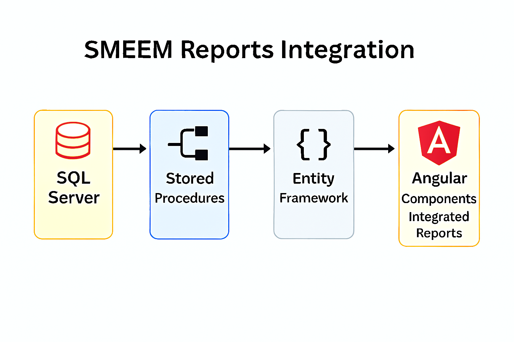
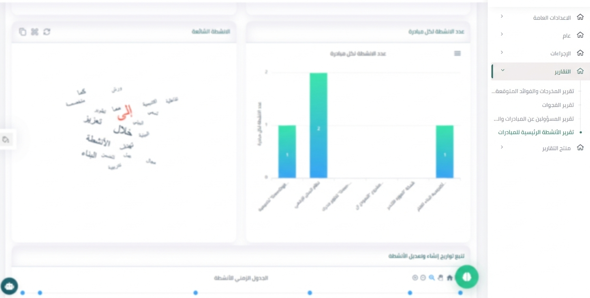

# SMEEM Platform – Strategic Vision Grid

## 📌 Overview
Developed multiple integrated reports within the **SMEEM platform** to support initiatives, projects, and strategic planning.  
The solution combines backend logic, stored procedures, and Angular components to deliver complex, interactive reporting experiences.

---

## 🎯 Objectives
- Provide unified reporting for initiatives, projects, and strategies.  
- Enable decision-makers to access consolidated insights in one platform.  
- Handle complex queries efficiently using stored procedures.  
- Ensure scalability and maintainability with modular backend design.

---

## ⚙️ Features
- **Backend Integration**: Built with Entity Framework for seamless database access.  
- **Stored Procedures**: Optimized for complex queries and performance.  
- **Angular Components**: Interactive front-end modules for report visualization.  
- **Multi-Report Support**: Covers initiatives, projects, and strategic KPIs.  
- **Scalable Design**: Easily extendable to new reporting requirements.

---

## 🛠️ Technical Implementation
- **Backend**: Entity Framework with C# for ORM and business logic.  
- **Database**: SQL Server with stored procedures for complex queries.  
- **Frontend**: Angular components for dynamic report rendering.  
- **Architecture**: Modular design ensuring integration across SMEEM platform modules.

---

## 📊 Workflow Diagram

------
## 📊 UI-Dashboard

---

## 📈 Business Value
- Improved visibility into initiatives and project progress.  
- Enhanced strategic planning with consolidated insights.  
- Reduced manual reporting effort through automation.  
- Provided a scalable framework for future reporting needs.

---

## 📄 Future Enhancements
- Add predictive analytics for initiative success forecasting.  
- Integrate dashboards with drill-down capabilities.  
- Support multilingual reporting for broader accessibility.  
- Enable export to PDF/Excel for offline analysis.

---

## 🔗 Notes
This repository includes **documentation, diagrams, and screenshots only**.  
Source code and sensitive SMEEM platform data are excluded due to confidentiality.
The dashboard screenshot has been **blurred intentionally** to protect sensitive information while preserving layout and structure.
