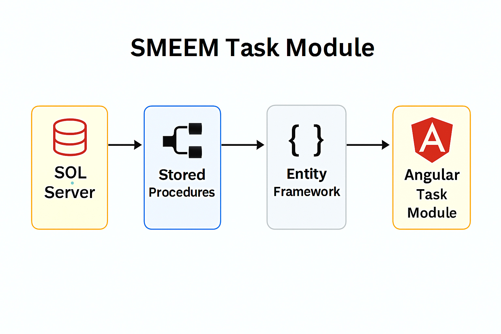
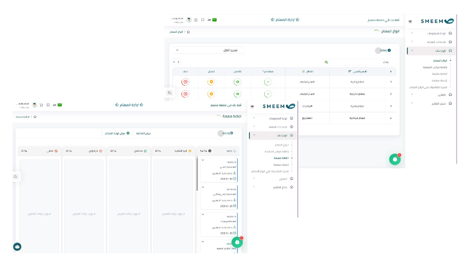

# SMEEM Platform – Task Management Module

## 📌 Overview
Developed a task management module integrated into the **SMEEM platform** to help organizations create, assign, and track tasks across initiatives and projects.  
The solution provides a centralized way to manage workloads, deadlines, and responsibilities, ensuring better collaboration and visibility.

---

## 🎯 Objectives
- Enable organizations to add and manage tasks within the SMEEM platform.  
- Provide visibility into task progress across initiatives and projects.  
- Reduce manual tracking effort and improve accountability.  
- Deliver a scalable, modular task system aligned with SMEEM’s architecture.

---

## ⚙️ Features
- **Task Creation & Assignment**: Add tasks, assign owners, and set deadlines.  
- **Progress Tracking**: Monitor task status and completion rates.  
- **Backend Integration**: Entity Framework for database access and business logic.  
- **Stored Procedures**: Handle complex queries for task dependencies and reporting.  
- **Angular Components**: Interactive front-end for task lists, boards, and filters.  
- **Scalability**: Extendable to support future workflow automation.

---

## 🛠️ Technical Implementation
- **Backend**: Entity Framework with C# for ORM and logic.  
- **Database**: SQL Server with stored procedures for complex queries.  
- **Frontend**: Angular components for dynamic task visualization.  
- **Architecture**: Modular design integrated seamlessly into SMEEM platform.

---

## 📊 Workflow Diagram

---
## 📊 UI-for One Page of the module

---

## 📈 Business Value
- Improved organizational efficiency with centralized task management.  
- Enhanced collaboration across initiatives and projects.  
- Reduced manual tracking and reporting overhead.  
- Provided a scalable framework for future workflow automation.

---

## 📄 Future Enhancements 
- Integrate notifications and reminders.  
- Support recurring tasks and dependencies.  

---

## 🔗 Notes
This repository includes **documentation, diagrams, and screenshots only**.  
Source code and sensitive SMEEM platform data are excluded due to confidentiality.
The UI screenshot has been **blurred intentionally** to protect sensitive information while preserving layout and structure.
