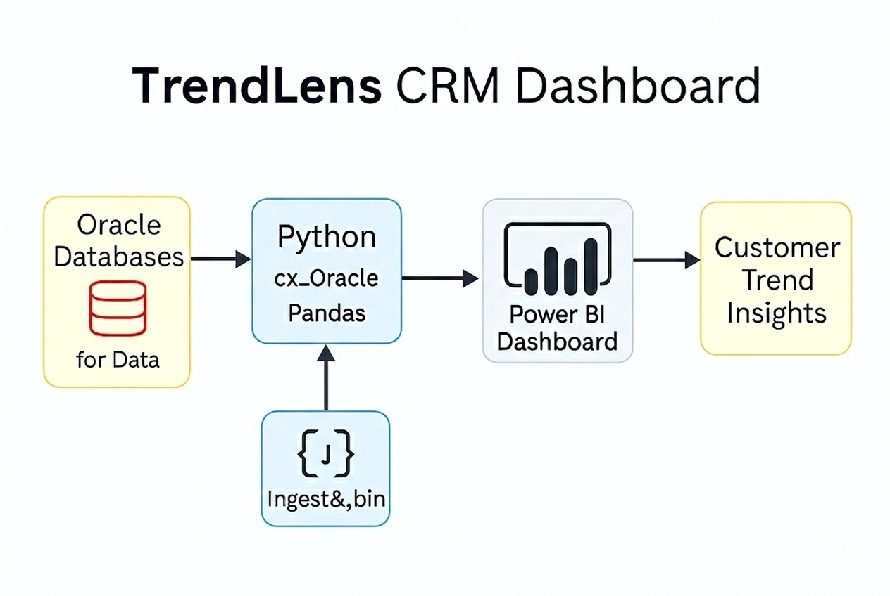
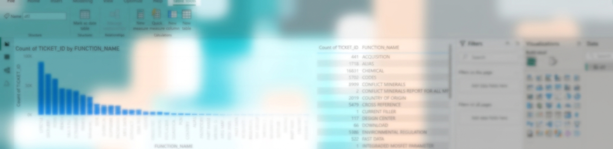

# TrendLens CRM Dashboard – Zendesk Integration

## 📌 Overview
TrendLens is a Power BI dashboard designed to analyze customer behavior and engagement patterns within the Zendesk CRM system.  
It focuses on identifying demand trends for electronic part attributes such as **PFAS**, **RoHS**, **REACH**, **Lifecycle**, and more.  
The dashboard helps product teams and customer success managers understand what matters most to customers and tailor their strategies accordingly.

---

## 🎯 Objectives
- Detect customer interest trends across regulatory and lifecycle attributes.  
- Improve engagement by aligning responses with customer priorities.  
- Provide actionable insights to sales, support, and product teams.  
- Enable scalable, updatable analytics using Python-based data pipelines.

---

## ⚙️ Features
- **Trend Detection**: Highlights most requested attributes (PFAS, RoHS, REACH, etc.).  
- **Customer Segmentation**: Filters by region, account type, and engagement level.  
- **Engagement Insights**: Tracks ticket volume, attribute mentions, and resolution patterns.  
- **Dynamic Filtering**: Interactive Power BI visuals for deep exploration.  
- **Python-Powered ETL**: Uses Pandas and cx_Oracle to connect to multiple databases and generate clean DataFrames.

---

## 🛠️ Technical Implementation
- **Data Source**: Multiple Oracle databases accessed via Python and cx_Oracle.  
- **ETL Pipeline**: Python scripts extract, clean, and transform data into structured DataFrames.  
- **Visualization Layer**: Power BI dashboard built on top of Python-generated datasets.  
- **Update Flexibility**: Easily extendable pipeline for future enhancements and deeper text analysis.

---

## 📊 Workflow Diagram

---

## 📊 Dashboard
  

---

## 📈 Business Value
- Improved understanding of customer priorities and regulatory concerns.  
- Enhanced targeting and engagement strategies.  
- Reduced guesswork in product support and feature planning.  
- Scalable analytics framework for future CRM initiatives.

---

## 📄 Future Enhancements
- Add NLP-based text stripping and keyword clustering.  
- Integrate with additional CRM platforms (e.g., Salesforce, HubSpot).  
- Enable predictive modeling for customer churn and interest forecasting.  
- Support multilingual analysis for global customer base.

---

## 🔗 Notes
This repository includes **Python ETL scripts**, **dashboard screenshots**, and **documentation**.  
Source data and full Power BI files are excluded due to confidentiality.  
The dashboard screenshot has been **blurred intentionally** to protect sensitive information while preserving layout and structure.
